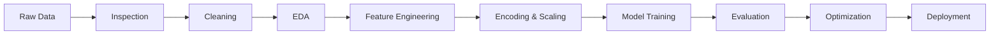

# 👋 Hi, I'm Vishesh Kumar Modanwal

### `AI/ML` • `Data Analytics` • `Data Visualization` • `Cybersecurity`

<p align="center">
  
</p>

<p align="center">
  <a href="https://github.com/YOUR_GITHUB_USERNAME">
    
  </a>
  <a href="https://www.linkedin.com/in/YOUR_LINKEDIN_USERNAME/">
    
  </a>
  <a href="mailto:YOUR_EMAIL@example.com">
    
  </a>
</p>

<p align="center">
  
</p>

---

## 🧑‍💻 About Me

🎓 **Final-year B.Tech Computer Science student specializing in AI & ML**

I build practical, data-driven applications that transform:

> **Raw Data → Insights → Machine Learning → Interactive Applications**

My main areas of interest are:

* 🤖 Artificial Intelligence & Machine Learning
* 📊 Data Analytics & Visualization
* 📈 Business Intelligence
* 🧠 Generative AI & Agentic AI
* 🔐 Cybersecurity & ML for Security
* 🌐 Streamlit Applications
* ⚡ FastAPI & ML APIs

I'm particularly interested in building **end-to-end projects rather than only experimenting with individual models.**

---

# 🚀 What I Build

<table>
<tr>
<td width="50%">

### 🤖 Machine Learning

* Classification
* Regression
* Clustering
* Feature Engineering
* Model Optimization
* Predictive Systems

</td>

<td width="50%">

### 📊 Data Analytics

* EDA
* Data Cleaning
* Statistical Analysis
* Business KPIs
* Interactive Dashboards
* Data Visualization

</td>
</tr>

<tr>
<td>

### 🧠 AI Applications

* Generative AI
* Agentic AI
* NLP
* ML-powered applications
* Intelligent automation

</td>

<td>

### 🔐 Cybersecurity

* Network Security
* Cryptography
* Malware Analysis
* Phishing Detection
* ML for Security

</td>
</tr>
</table>

---

# ⚡ Tech Stack

## 🐍 Languages & Core

<p align="center">
  
</p>

## 🤖 AI / ML

<p align="center">
  
</p>

<p align="center">


</p>

## 🌐 Development & Deployment

<p align="center">


</p>

---

# 🏆 Featured Projects

## 💰 N100 Financial Intelligence Platform

> **End-to-End Financial Analytics, Screening & Portfolio Intelligence**

A large-scale financial intelligence platform that combines data engineering, analytics, machine learning and interactive visualization.

### 🔥 Key Capabilities

```text
Financial Data
      │
      ▼
Data Quality & Validation
      │
      ▼
50+ Financial KPIs
      │
      ├──────────────► Company Screener
      │
      ├──────────────► Peer Analysis
      │
      ├──────────────► Valuation
      │
      ├──────────────► NLP Pros & Cons
      │
      └──────────────► ML Company Archetypes
                           │
                           ▼
                  Portfolio Allocation
```

**Tech:** Python • Pandas • SQL • Scikit-learn • FastAPI • Streamlit • NLP

<p>
<a href="https://github.com/YOUR_GITHUB_USERNAME/N100-Financial-Intelligence-Platform">

</a>
</p>

---

## 🏠 Real Estate Buyer Segmentation

### Machine Learning Based Buyer Segmentation and Investment Profiling

A machine-learning project for understanding buyer behavior and identifying meaningful real-estate customer segments.

### 🔬 Pipeline

```text
Raw Client Data
      ↓
Cleaning
      ↓
Feature Engineering
      ↓
Encoding
      ↓
Standardization
      ↓
K-Means + Hierarchical Clustering
      ↓
Elbow + Silhouette Analysis
      ↓
Cluster Interpretation
      ↓
Investment Profiles
      ↓
Interactive Streamlit Dashboard
```

### 📊 Dashboard

* 👥 Buyer Overview
* 💰 Investor Behavior
* 🌍 Geographic Analysis
* 📈 Segment Insights
* 🔎 Interactive Filtering

<p>
<a href="https://github.com/YOUR_GITHUB_USERNAME/real-estate-buyer-segmentation">

</a>
</p>

---

## 🤖 AutoML Data Science Platform

An interactive AutoML platform designed to guide users through the complete machine-learning workflow.

### 🔄 Automated Pipeline

```text
Upload Dataset
      ↓
Inspection
      ↓
Quality Analysis
      ↓
EDA
      ↓
Cleaning
      ↓
Encoding
      ↓
Feature Engineering
      ↓
Preprocessing
      ↓
AutoML
      ↓
Model Evaluation
```

### ✨ Features

* 📁 CSV / XLSX / XLS / TSV / JSON
* 🔍 Dataset Inspection
* 🧹 Automated Cleaning
* 📊 EDA
* 🚨 Outlier Detection
* 🔤 Encoding
* ⚙️ Feature Engineering
* 🤖 Model Training
* 📈 Model Comparison
* 🎨 Interactive Visualization

<p>
<a href="https://github.com/YOUR_GITHUB_USERNAME/AutoML">

</a>
</p>

---

# ❤️ ML Prediction Systems

| Project                       | Problem               | Technologies                 |
| ----------------------------- | --------------------- | ---------------------------- |
| ❤️ Heart Disease Predictor    | Healthcare Prediction | KNN, Scikit-learn, Streamlit |
| 🩸 Diabetes Predictor         | Diabetes Prediction   | ML, Streamlit                |
| 🏠 Bangalore House Prediction | Price Prediction      | Regression                   |
| 🛡️ Phishing URL Detection    | Cybersecurity         | ML                           |
| 💳 UPI Fraud Detection        | Fraud Detection       | ML                           |
| 🌦️ Weather Report            | Data Visualization    | Python, Streamlit            |
| 👨‍🎓 Attendance Management   | Application           | Python                       |

---

# 🧪 My Typical ML Workflow



---

# 📊 GitHub Analytics

<p align="center">
  
  
</p>

<p align="center">
  
</p>

---

# 🐍 Contribution Activity

<p align="center">
  
</p>

> 🐍 My contribution graph, visualized as a snake animation.

### ⚙️ Enable the Snake

Create:

```text
.github/workflows/snake.yml
```

with:

```yaml
name: Generate Snake

on:
  schedule:
    - cron: "0 0 * * *"
  workflow_dispatch:

jobs:
  generate:
    runs-on: ubuntu-latest

    steps:
      - uses: Platane/snk@v3
        with:
          github_user_name: ${{ github.repository_owner }}
          outputs: |
            dist/github-contribution-grid-snake.svg

      - uses: crazy-max/ghaction-github-pages@v4
        with:
          build_dir: dist
        env:
          GITHUB_TOKEN: ${{ secrets.GITHUB_TOKEN }}
```

After the workflow runs, update the image URL if necessary.

---

# 🎧 Currently Listening

<p align="center">

<!-- Replace with your Spotify dynamic widget if you use one -->

<a href="https://open.spotify.com/">

</a>

</p>

> 🎵 Music + debugging = surprisingly productive.

---

# 💭 Developer Mindset

<p align="center">

> **"Don't just learn the technology — build something with it."**

</p>

```text
Learn
  ↓
Experiment
  ↓
Build
  ↓
Break
  ↓
Debug
  ↓
Improve
  ↓
Deploy
  ↓
Document
```

---

# 📚 Current Learning Roadmap

```text
                 AI / ML
                   │
          ┌────────┴────────┐
          ▼                 ▼
      Generative AI     Data Analytics
          │                 │
          ▼                 ▼
      Agentic AI         Power BI
          │                 │
          └────────┬────────┘
                   ▼
              Intelligent
               Systems
                   │
          ┌────────┴────────┐
          ▼                 ▼
     Cybersecurity      Deployment
          │                 │
          ▼                 ▼
       Linux +          FastAPI +
      Networking        Cloud/Apps
```

---

# 💼 Experience

### 📊 Data Analyst Intern — Bluestock Fintech

Worked on:

* Data analysis
* Data preprocessing
* Visualization
* Business insights
* Analytical reporting

---

### 🤖 ML with Python — Robokwik / IIT Kanpur

Worked on machine-learning workflows and **Sales Forecast Prediction**.

---

### 🔐 Cybersecurity Virtual Internship — IBM

Explored cybersecurity fundamentals and practical security concepts.

---

### 🤖 AI Transformative Learning — TechSaksham / Edunet Foundation

Focused on practical AI concepts and project-based learning.

---

# 🎯 Career Direction

I'm building toward a career where I can combine:

```text
AI / ML
   +
Data Analytics
   +
Software Development
   +
Cybersecurity
```

with a focus on creating **practical, deployable and decision-oriented intelligent systems.**

---

# 🤝 Let's Connect

<p align="center">

<a href="https://www.linkedin.com/in/YOUR_LINKEDIN_USERNAME/">

</a>

<a href="mailto:YOUR_EMAIL@example.com">

</a>

<a href="https://github.com/YOUR_GITHUB_USERNAME">

</a>

</p>

---

<p align="center">

### 🚀 Building • Learning • Experimenting • Improving

⭐ **Explore my repositories and let's build something useful!**

</p>
